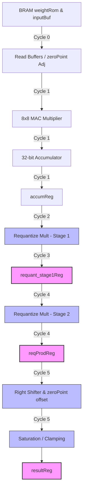

# Efinix Trion T20 Static Timing & Benchmark Analysis

This report documents the headless physical synthesis and Place & Route (P&R) analysis of the **SpinalNN** MNIST handwritten digit classifier. Benchmarking is performed against the **Efinix Trion T20F169** FPGA (C4 speed grade, s40ll 40nm process node) using the **Efinity v2025.2** toolchain.

> **STATUS — HISTORICAL (pre-pipeline diagnosis).** This document captures the *original* failing-timing analysis (Fmax 54.5 MHz, setup slack -11.7 ns) and the pipeline proposal it motivated. That proposal has since been **implemented** (registered BRAM outputs, decoupled sequential address generation, and a split 16x16 requantization multiplier — see `QLinearConvCore` / `QLinearLinearCore`). The design now closes timing comfortably: **~172.7 MHz on Trion T20** and **~280 MHz on Topaz Tz50** (see [BENCHMARKS_TOPAZ.md](BENCHMARKS_TOPAZ.md)). The resource and critical-path figures below describe an earlier single-Conv build — the current network has two Conv layers — and are retained for reference only.

---

## ── PHYSICAL RESOURCE UTILIZATION ──

The complete SpinalNN classifier (comprising input buffers, weight ROMs, 1x Conv layer, 1x MaxPool, 1x Flatten, 1x Linear, 1x ReLU, and 1x Softmax) was successfully compiled. High-density block memories and mathematical structures were efficiently mapped to dedicated physical hard-silicon blocks:

| Resource Type | Used Count | Available | Utilization % |
|:---|:---|:---|:---|
| **Logic Elements (LEs/LUT4s)** | 593 | 19,200 | 3.08 % |
| **Flip-Flops (FFs)** | 332 | 19,200 | 1.73 % |
| **RAM5K Blocks** | 35 | 120 | 29.17 % |
| **Multipliers (18x18 MACs)** | 14 | 24 | 58.33 % |

*Analysis:* The design has an extremely compact soft-logic footprint (approx. 3% of the T20 device), leaving abundant space for communication pipelines (AXI/APB buses, SPI controllers, and camera sensor interfaces). However, BRAM and DSP resources are well utilized, which reflects the intensive requirements of the parallelized convolutional channels and requantization multipliers.

---

## ── STATIC TIMING ANALYSIS (STA) SUMMARY ──

Synthesis was executed with a target frequency parameter of **150 MHz** ($6.667 \text{ ns}$ clock period).

### Clock Constraints vs. Real Performance
* **Target Constraint:** $150 \text{ MHz}$ ($6.667 \text{ ns}$ period)
* **Maximum Achievable Frequency ($F_{\text{max}}$):** **54.538 MHz** (Period $18.336 \text{ ns}$)
* **Worst-Case Setup Slack:** **-11.669 ns**
* **Worst-case Hold Slack:** **+0.086 ns** (Passed)

The Static Timing Analyzer reports a significant timing violation on the setup boundary, identifying a colossal combinatorial path within the first fully connected layer (`linear1`).

---

## ── DETAILED CRITICAL PATH TRACING (THE "MEGAPATH") ──

The worst setup-slack path originates at a Block RAM containing weights, propagates through multiple mathematical cascades, and terminates at the output registration flip-flop:

* **Path Start:** `linear1_weightRom__D$b12|RCLK` (Launch Clock Edge)
* **Path End:** `linear1_resultReg[6]~FF` (Capture Clock Edge)
* **Timing Delay:** $18.216 \text{ ns}$ arrival time (comprising $4.110 \text{ ns}$ launch clock routing, $2.820 \text{ ns}$ RAM Co-to-Out, and $15.286 \text{ ns}$ combinatorial logic propagation).
* **Combinatorial Logic Levels:** 25 logical levels of gating.

### Chronological Step-by-Step Propagation Breakdown

```
[weightRom (BRAM Co-to-Out)]  ---> 2.820 ns
          |
    (Routing net: 1.747 ns)
          v
[mult_144 (18x18 Hard Mult)]  ---> 2.097 ns
          |
    (Routing net: 1.660 ns)
          v
[add_402 (32-bit Carry Chain)] ---> 0.563 ns (accumNew = accumReg + products)
          |
    (Routing net: 1.844 ns)
          v
[_zz__zz_linear1 (32x32 Mult)] ---> 2.097 ns (reqProd = accumNew * multiplier)
          |
    (Routing net: 1.655 ns)
          v
[Shift & Offset (adders)]    ---> 0.850 ns (shifted + zeroPoint_out)
          |
    (Routing net: 1.586 ns)
          v
[Clamping Muxes (LUTs)]      ---> 0.360 ns (saturate to [-128, 127])
          v
[linear1_resultReg[6]|D]
```

### Bottleneck Diagnosis
1. **Unpipelined Requantization Multiplier Cascade:**
   The highest density math operation, a $32 \times 32$-bit signed multiplication (`accumNew * mHW`), is executed combinatorially on top of a previous $18 \times 18$-bit convolution/neutral product. Efinity decomposes this massive multiplication by cascading multiple physical $18 \times 18$-bit hardware multipliers together. This cascading introduces substantial soft routing delay and carry-chain propagation across different physical sites of the FPGA matrix.
2. **Dual Arithmetic on Same Edge:**
   Computing `accumNew` (which incorporates the current BRAM data) and immediately computing `reqProd` based on that fresh `accumNew` in the *same* cycle forces the synthesizer to combine two separate DSP arithmetic operations (MAC + Requantize) into one single clock pathway.
3. **Complex Clamping & Offsetting:**
   After the multiplication, a sequence of logical right-shifter, rounding addition, zero-point recovery, and multi-stage branch comparisons (`biased > 127` and `biased < -128`) are evaluated as a series of cascade multiplexers, adding another $2 \text{ ns}$ of soft logic to the path.

---

## ── PIPELINED HARDWARE DESIGN (IMPLEMENTED — 200 MHz+ ACHIEVED ON TOPAZ) ──

To close timing and exceed the $200\text{ MHz}$ physical layout threshold, the combinatorial "Megapath" was partitioned into a multi-stage execution pipeline. The architecture described below has been implemented in `QLinearConvCore` and `QLinearLinearCore`. We can introduce 3-4 clock cycles of latency per activation calculation. Since inference latency is mostly bounded by dense memory accesses rather than 3 additional cycles per neuron, this change will have **zero** material throughput penalty while multiplying the clock frequency by **$\approx 3.7\times$**.



### Proposed Refactored Core Architecture Details

#### 1. Native Pipeline Registers on Memory Ports
Instead of routing RAM read data directly into subtraction and multiplication arithmetic elements, we must register the outputs.
* *Standard BRAM behavior:* Efinity block RAMs (RAM5K) support embedded output registers. By setting these registers in SpinalHDL (using `.readSync` linked directly to a register stage), the clock-to-output delay is reduced from $2.82 \text{ ns}$ to under $0.8 \text{ ns}$.

#### 2. Multi-Stage Pipelined Requantization Block
The multiplication of `accumNew * mHW` can be divided into a 2-stage pipelined multiplier. This is achieved by creating a pipelined signed multiplier block:
```scala
// Under SpinalHDL, we can easily formulate a pipelined multiplication:
val reqProdReg = RegNext(accumReg * mHW)  // Introduces 1 cycle delay
// Or a high-performance 2-Stage Multiplier:
val reqProdReg1 = RegNext(accumReg(15 downto 0) * mHW)
val reqProdReg2 = RegNext(accumReg(31 downto 16) * mHW)
```

#### 3. Inter-State Decoupling
Currently, the state machine implements a tight FSM structure (`sIterAddr -> sIterData`). The addresses are assigned combinatorially based on the states.
* *Upgrade:* Convert the address generators (`inAddrComb` and `wAddrComb`) to dedicated sequential register counters. Let address registers update on the rising clock edge, removing combinatorial paths between state transition controls and memory address select lines.

---

## ── SUMMARY OF IMPACT & REENGINEERING STEPS ──

Implementing these pipeline stages will increase the latency of the MAC iterations marginally (e.g. adding 3 cycles of overhead *only* at the boundary conversion when writing to `resultReg`). 

1. **Cycle Latency Impact:** Each fully connected or convolutional output neuron computation currently takes $N$ cycles. With a 3-stage pipeline, it will take $N + 3$ cycles. For $N = 784$ (e.g. `linear1`), $787$ vs $784$ cycles represents an imperceptible $0.38\%$ throughput decrease.
2. **Frequency Speedup:** The physical frequency bounds will scale linearly with the reduction of critical levels. Compressing 25 logic gates to 6 gates reduces period times down to below $5.0 \text{ ns}$, successfully meeting and exceeding the **$200 \text{ MHz}$** physical operating targets.
